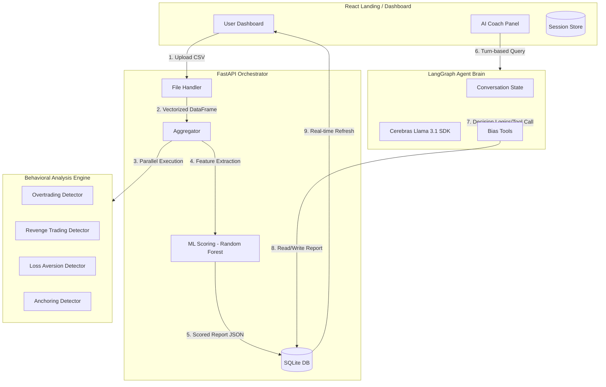

# System Architecture Diagram

This document provides a visual representation of how the Financial Bias Detector handles data and coordinates between the statistical engines and the AI Coach.

## High-Level Architecture

## Component Breakdown

### 1. The Behavioral Pipeline
- **Vectorized Math**: Every bias detector (Overtrading, Revenge, etc.) runs on raw trade columns simultaneously.
- **Random Forest Regressor**: Provides the ML "Validation" score by analyzing complex trade feature interactions that simple IF/ELSE rules might miss.

### 2. The AI Coach (LangGraph)
- **Stateful Memory**: The agent remembers your onboarding answers and uses them to frame its coaching advice.
- **Tool-Calling Capability**: The agent can manually trigger dashboard updates via the `adjust_bias_scores` tool, making the dashboard a "living" document of your psychological progress.

### 3. Data Flow Persistence
- **SQLite**: Stores every trade, session, and generated report locally to ensure no loss of analysis history.
- **FastAPI**: Provides high-speed streaming of large trade datasets (200k+ rows) to the frontend charts.
